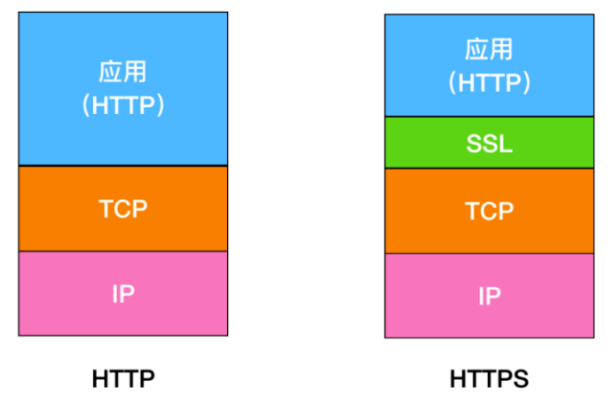
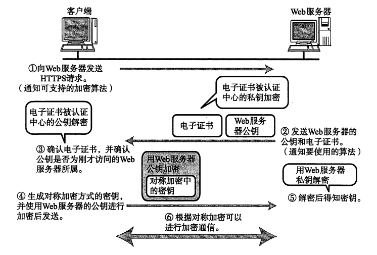

# 1. HTTP的不足

- 使用**明文通信**，可能会遭遇**窃听**
- **不验证通信方身份**，因此有可能遭遇**伪装**（即使是无意义的请求也会照单全收，无法阻止海量请求下的DoS攻击（Denial of Service，拒绝服务攻击））
- **无法证明报文的完整性**，可能会遭遇**篡改**（在请求和响应传输过程中，遭攻击者拦截并篡改内容的攻击，称为中间人攻击（Man-in-the-Middle attack, MITM））

# 2. HTTP和HTTPS的区别

- HTTPS正是为了解决HTTP的不足

- HTTPS并非是应用层的一种新协议，只是HTTP**通信接口部分**用SSL(Secure Socket Layer，安全套接层)和TLS(Transport Layer Security, 安全传输层协议)协议代替而已

- 通常，**HTTP直接和TCP通信。当使用SSL时，则演变成先和SSL通信，再由SSL和TCP通信**，简而言之，所谓HTTPS，就是身披SSL外壳的HTTP

- 在采用SSL后，HTTP就拥有了HTTPS的**加密、证书和完整性保护**这些功能

## 2.1 SSL和TLS

- HTTPS使用SSL和TLS这两个协议
- SSL技术最初由浏览器开发商网景通信公司率先倡导的，开发过SSL3.0之前的版本。目前主导权已转移到IETF（Internet Engineering Task Force, Internet工程任务组）的手中
- IETF以SSL3.0为基准，后又制定了TLS1.0、TLS1.1和TLS1.2。TLS是以SSL为原型开发的协议，有时会统称为SSL
- **当前主流的版本是SSL3.0和TLS1.0**

## 2.2 SSL速度慢吗？

- HTTPS也存在一些问题，当使用SSL时，它的**处理速度会变慢**
- SSL的慢分两种：
  - 一种是通信慢；除去和TCP连接、发送HTTP请求和响应以外，还必须进行SSL通信，因此整体上处理**通信量不可避免会增加**
  - 另一种是指由于大量消耗CPU及内存等资源，导致处理速度变慢；SSL必须进行加密处理，服务器和客户端都需要进行**加密和揭秘的运算处理，比起HTTP会更多的消耗硬件资源，导致负载增强**
  - 没有根本性的解决方案，可以使用SSL加速器（SSL通信专用硬件）来分担负载，改善该问题

## 2.3 两者区别

- 最简单的，HTTP 在地址栏上的协议是以 `http://` 开头，而 HTTPS 在地址栏上的协议是以 `https://` 开头
- HTTP 是未经安全加密的协议，它的传输过程容易被攻击者监听、数据容易被窃取、发送方和接收方容易被伪造；而 HTTPS 是安全的协议，它通过 **密钥交换算法 - 签名算法 - 对称加密算法 - 摘要算法** 能够解决上面这些问题
- HTTP 的默认端口是 80，而 HTTPS 的默认端口是 443

# 3. HTTPS密钥交换过程

- HTTPS采用**共享秘钥加密**（对称秘钥）和**公开秘钥加密**（非对称秘钥）两者并用的混合加密机制。在**交换秘钥环节**使用公开秘钥加密方式，之后的**建立通信交换报文**阶段则使用共享秘钥加密方式
- 可信赖的第三方数字证书认证机构的业务流程：
  - 首先，服务器的运营人员向数字证书认证机构提出公开秘钥的申请
  - 数字证书认证机构在判明提出申请者的身份之后，对已申请的公开秘钥做数字签名
  - 将该公开秘钥放入公钥证书后绑定在一起
- **HTTPS秘钥交换过程**：
  - 服务器将这份由数字证书认证机构颁发的公钥证书（服务器的公开秘钥+数字证书认证机构的数字签名，也可叫做数字证书或证书）发送给客户端
  - 接到证书的客户端可使用数字证书认证机构的公开秘钥（浏览器开发商发布版本时会事先在内部植入常用认证机构的公开秘钥）对证书上的数字签名进行验证
  - 验证通过客户端可明确两件事：
    - 认证服务器的公开密钥是真实有效的数字证书认证机构
    - 服务器的公开秘钥是值得信赖的

# 4. HTTPS握手过程

探讨 HTTPS 的握手过程，其实就是 SSL/TLS 的握手过程。

TLS 旨在为 Internet 提供通信安全的加密协议。TLS 握手是启动和使用 TLS 加密的通信会话的过程。在 TLS 握手期间，Internet 中的通信双方会彼此交换信息，验证密码套件，交换会话密钥。

每当用户通过 HTTPS 导航到具体的网站并发送请求时，就会进行 TLS 握手。除此之外，每当其他任何通信使用HTTPS（包括 API 调用和在 HTTPS 上查询 DNS）时，也会发生 TLS 握手。

TLS 具体的握手过程会根据所使用的`密钥交换算法的类型`和双方支持的`密码套件`而不同。我们以`RSA 非对称加密`来讨论这个过程。整个 TLS 通信流程图如下

- 在进行通信前，首先会进行 HTTP 的三次握手，握手完成后，再进行 TLS 的握手过程
- ClientHello：客户端通过向服务器发送 `hello` 消息来发起握手过程。这个消息中会夹带着客户端支持的 `TLS 版本号(TLS1.0 、TLS1.2、TLS1.3)` 、客户端支持的密码套件、以及一串 `客户端随机数`
- ServerHello：在客户端发送 hello 消息后，服务器会发送一条消息，这条消息包含了服务器的 SSL 证书、服务器选择的密码套件和服务器生成的随机数
- 认证(Authentication)：客户端的证书颁发机构会认证 SSL 证书，然后发送 `Certificate` 报文，报文中包含公开密钥证书。最后服务器发送 `ServerHelloDone` 作为 `hello` 请求的响应。第一部分握手阶段结束
- `加密阶段`：在第一个阶段握手完成后，客户端会发送 `ClientKeyExchange` 作为响应，这个响应中包含了一种称为 `The premaster secret` 的密钥字符串，这个字符串就是使用上面公开密钥证书进行加密的字符串。随后客户端会发送 `ChangeCipherSpec`，告诉服务端使用私钥解密这个 `premaster secret` 的字符串，然后客户端发送 `Finished` 告诉服务端自己发送完成了。

> Session key 其实就是用公钥证书加密的公钥。

- `实现了安全的非对称加密`：然后，服务器再发送 `ChangeCipherSpec` 和 `Finished` 告诉客户端解密完成，至此实现了 RSA 的非对称加密。