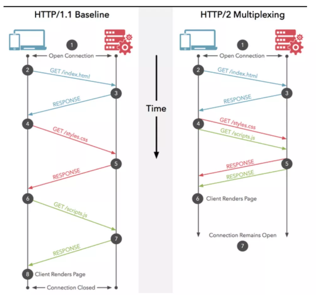

## 1. 什么是协议

协议是指双方或多方，相互约定好，通信方都需要遵守的规则，叫协议。

## 2. HTTP协议

所谓HTTP协议(HyperText Transfer Protocol，超文本传输协议)就是客户端和服务器通信时需要遵守的规则。

## 3. 请求的HTTP协议格式

**请求**：客户端给服务器发送数据，分为GET请求和POST请求两种

**响应**：服务器给客户端回传数据

### 3.1 GET请求

```http
GET /07_servlet/servlet1 HTTP/1.1
Host: localhost:8088
Connection: keep-alive
User-Agent: Mozilla/5.0 (Windows NT 10.0; Win64; x64) AppleWebKit/537.36 (KHTML, like Gecko) Chrome/88.0.4324.150 Safari/537.36 Edg/88.0.705.68
Accept: text/html,application/xhtml+xml,application/xml;q=0.9,image/webp,image/apng,*/*;q=0.8,application/signed-exchange;v=b3;q=0.9
Accept-Encoding: gzip, deflate, br
Accept-Language: zh-CN,zh;q=0.9,en;q=0.8,en-GB;q=0.7,en-US;q=0.6
```

1. 请求行

   （1）请求的方式                                         `GET     `

   （2）请求的资源路径[+?+请求参数]        ` /07_servlet/servlet1`

   （3）请求的协议版本号                             `HTTP/1.1`

2. 请求头

   key:value  组成         不同的键值对，表示不同的含义

   | key             | 含义                                                         |
   | --------------- | ------------------------------------------------------------ |
   | Host            | 表示请求的服务器ip和端口号                                   |
   | Connection      | 告诉服务器请求连接如何处理<br>keep-alive：告诉服务器回传数据不要马上关闭，保持一小段时间的连接；<br>closed：马上关闭 |
   | User-Agent      | 浏览器信息                                                   |
   | Accept          | 告诉服务器，客户端可以接收的数据类型                         |
   | Accept-Encoding | 告诉服务器，客户端可以接收的数据编码（压缩）格式             |
   | Accept-Language | 告诉服务器，客户端可以接收的语言类型                         |

### 3.2 POST请求

```http
POST /07_servlet/parameterServlet HTTP/1.1
Host: localhost:8088
Connection: keep-alive
Content-Length: 35
Cache-Control: max-age=0
Content-Type: application/x-www-form-urlencoded
User-Agent: Mozilla/5.0 (Windows NT 10.0; Win64; x64) AppleWebKit/537.36 (KHTML, like Gecko) Chrome/88.0.4324.150 Safari/537.36 Edg/88.0.705.68
Accept: text/html,application/xhtml+xml,application/xml;q=0.9,image/webp,image/apng,*/*;q=0.8,application/signed-exchange;v=b3;q=0.9
Referer: http://localhost:8088/07_servlet/form.html
Accept-Encoding: gzip, deflate, br
Accept-Language: zh-CN,zh;q=0.9,en;q=0.8,en-GB;q=0.7,en-US;q=0.6

username=y11&password=123&hobby=cpp
```

1. 请求行

   （1）请求的方式                                         `POST     `

   （2）请求的资源路径[+?+请求参数]        ` /07_servlet/parameterServlet`

   （3）请求的协议版本号                             `HTTP/1.1`

2. 请求头

   key:value  组成         不同的键值对，表示不同的含义

   | key            | 含义                                                         |
   | -------------- | ------------------------------------------------------------ |
   | Content-Length | 表示发送的数据长度                                           |
   | Cache-Control  | 表示如何控制缓存                                             |
   | Referer        | 表示请求发起时，浏览器地址栏中的地址（从哪来）               |
   | Content-Type   | 表示发送的数据类型<br>application/x-www-form-urlencoded：<br>表示提交的数据格式是：name=value&name=value，然后对其进行url编码，<br>url编码是把非英文内容转换为：%xx%xx）<br>multipart/form-data<br>表示以多段的形式提交数据给服务器（以流的形式提交，用于上传） |

**空行**

3. 请求体

   就是发送给服务器的数据：username=y11&password=123&hobby=cpp

### 3.3 GET 和 POST 区别

- **get 方法一般用于请求**，比如你在浏览器地址栏输入 `www.cxuanblog.com` 其实就是发送了一个 get 请求，**它的主要特征是请求服务器返回资源**，**而 post 方法一般用于`表单`的提交**，相当于是把信息提交给服务器，等待服务器作出响应，get 相当于一个是 pull/拉的操作，而 post 相当于是一个 push/推的操作

- **get 方法是不安全的**，因为你在发送请求的过程中，你的请求**参数会拼在 URL 后面**，从而导致容易被攻击者窃取，对你的信息造成破坏和伪造；

  ```http
  /test/demo_form.asp?name1=value1&name2=value2
  ```

  而 **post 方法是把参数放在请求体 body 中的，这对用户来说不可见**

  ```http
  POST /07_servlet/parameterServlet HTTP/1.1
  Host: localhost:8088
  Connection: keep-alive
  
  username=y11&password=123&hobby=cpp
  ```

- get 请求的 **URL 有长度限制**，而 post 请求会把参数和值放在消息体中，对数据长度没有要求

- get 请求会被浏览器主动 cache，而 post 不会，除非手动设置

- get 请求在浏览器**反复的 `回退/前进` 操作是无害的**，而 post 操作会再次提交表单请求

- get 请求在发送过程中会产生一个 TCP 数据包；post 在发送过程中会产生两个 TCP 数据包。对于 get 方式的请求，浏览器会把 http header 和 data 一并发送出去，服务器响应 200（返回数据）；而对于 post，浏览器先发送 header，服务器响应 100 continue，浏览器再发送 data，服务器响应 200 ok（返回数据）

## 4. 响应的HTTP协议格式

### 4.1 响应格式

```http
HTTP/1.1 200 OK
Server: Apache-Coyote/1.1
Date: Thu, 18 Feb 2021 11:04:21 GMT
Accept-Ranges: bytes
ETag: W/"611-1613640379836"
Last-Modified: Thu, 18 Feb 2021 09:26:19 GMT
Content-Type: text/html
Content-Length: 611

<!DOCTYPE html>
<html lang="en">
<head>
    <meta charset="UTF-8">
    <title>Title</title>
</head>
<body>
    <form action="http://localhost:8088/07_servlet/parameterServlet" method="post">
        用户名：<input type="text" name="username"><br/>
        密码：<input type="password" name="password"><br/>
        兴趣爱好：<input type="checkbox" name="hobby" value="cpp">C++
                <input type="checkbox" name="hobby" value="Java">Java
                <input type="checkbox" name="hobby" value="js">JavaScript<br/>
        <input type="submit">
    </form>
</body>
</html>
```

1. 响应行

   （1）响应的协议和版本号       `HTTP/1.1`

   （2）响应状态码                      `200`

   （3）响应状态描述符              `OK`

2. 响应头

   key : value          不同的响应头，表示不同的含义

   | key            | 含义                       |
   | -------------- | -------------------------- |
   | Server         | 表示服务器的信息           |
   | Content-Type   | 表示响应体的数据类型       |
   | Content-Length | 响应体的长度               |
   | Date           | 请求响应的时间（格林时间） |

**空行**

3. 响应体：回传给客户端的数据

   ```html
   <!DOCTYPE html>
   <html lang="en">
   <head>
       <meta charset="UTF-8">
       <title>Title</title>
   </head>
   <body>
       <form action="http://localhost:8088/07_servlet/parameterServlet" method="post">
           用户名：<input type="text" name="username"><br/>
           密码：<input type="password" name="password"><br/>
           兴趣爱好：<input type="checkbox" name="hobby" value="cpp">C++
                   <input type="checkbox" name="hobby" value="Java">Java
                   <input type="checkbox" name="hobby" value="js">JavaScript<br/>
           <input type="submit">
       </form>
   </body>
   </html>
   ```

### 4.2 常用的响应码说明

| 响应码 | 含义                                                       |
| ------ | ---------------------------------------------------------- |
| 200    | 请求成功                                                   |
| 302    | 请求重定向                                                 |
| 404    | 请求服务器已经收到了，但是请求的数据不存在（请求地址错误） |
| 500    | 服务器已经收到请求，但是服务器内部错误（代码错误）         |

## 5. MIME类型说明

MIME(Multipurpose Internet Mail Extensions, 多功能Internet邮件扩充服务)是HHTP协议中的数据类型。<br/>

MIME类型的格式是：大类型/小类型，并与某一种文件的扩展名相对应。<br/>

| 文件              | MIME类型   | 格式                     |
| ----------------- | ---------- | ------------------------ |
| 超文本标记语言    | .html,.htm | text/html                |
| 普通文本          | .txt       | text/plain               |
| RTF文本           | .rtf       | application/rtf          |
| GIF图形           | .gif       | image/gif                |
| JPEG图形          | .jpeg,.jpg | image/jpeg               |
| au声音文件        | .au        | audio/basic              |
| MIDI音乐文件      | .mid,.midi | audio/midi, audio/x-midi |
| RealAudio音乐文件 | .ra,.ram   | audio/x-pn-realaudio     |
| MPEG文件          | .mpg,.mpeg | video/mpeg               |
| AVI文件           | .avi       | video/x-msvideo          |
| GZIP文件          | .gz        | application/x-gzip       |
| TAR文件           | .tar       | application/x-tar        |

## 6. HTTP1.0和1.1和2.0的区别

### 6.1 HTTP1.0

HTTP 1.0 是在 1996 年引入的，从那时开始，它的普及率就达到了惊人的效果

- HTTP 1.0 **仅仅提供了最基本的认证**，这时候用户名和密码还未经加密，因此很容易收到**窥探**
- HTTP 1.0 被设计用来使用**短链接，即每次发送数据都会经过 TCP 的三次握手和四次挥手，效率比较低**
- HTTP 1.0 只使用 header 中的 If-Modified-Since 和 Expires 作为缓存失效的标准
- HTTP 1.0 **不支持断点续传**，也就是说，**每次都会传送全部的页面和数据**
- HTTP 1.0 认为每台计算机只能绑定一个 IP，所以**请求消息中的 URL 并没有传递主机名**（hostname）

### 6.2 HTTP1.1

HTTP 1.1 是 HTTP 1.0 开发三年后出现的，也就是 1999 年，它做出了以下方面的变化

- HTTP 1.1 **使用了摘要算法来进行身份验证**
- HTTP 1.1 **默认使用长连接，长连接就是只需一次建立就可以传输多次数据**，传输完成后，只需要一次切断连接即可。长连接的连接时长可以通过请求头中的 `keep-alive` 来设置
- HTTP 1.1 中新增加了 E-tag，If-Unmodified-Since, If-Match, If-None-Match 等缓存控制标头来控制缓存失效
- HTTP 1.1 **支持断点续传，通过使用请求头中的 `Range` 来实现**
- HTTP 1.1 使用了虚拟网络，在一台物理服务器上可以存在多个虚拟主机（Multi-homed Web Servers），并且它们共享一个IP地址

### 6.3 HTTP2.0

HTTP 2.0 是 2015 年开发出来的标准，它主要做的改变如下

- `头部压缩`，由于 HTTP 1.1 经常会出现 **User-Agent、Cookie、Accept、Server、Range** 等字段可能会占用几百甚至几千字节，而 Body 却经常只有几十字节，所以导致头部偏重。HTTP 2.0 使用 `HPACK` 算法进行压缩。
- `二进制格式`，HTTP 2.0 使用了更加靠近 TCP/IP 的二进制格式，而抛弃了 ASCII 码，提升了解析效率
- `强化安全`，由于安全已经成为重中之重，所以 HTTP2.0 一般都跑在 HTTPS 上
- `多路复用`，即每一个请求都是是用作连接共享。一个请求对应一个id，这样一个连接上可以有多个请求



## 7. Session 与 Cookie

### 7.1 简介

1. **HTTP协议是无状态的协议，所以服务端需要记录用户的状态时，就需要用某种机制来识具体的用户，这个机制就是Session**.典型的场景比如购物车，当你点击下单按钮时，由于HTTP协议无状态，所以并不知道是哪个用户操作的，所以**服务端要为特定的用户创建了特定的Session，用用于标识这个用户，并且跟踪用户，这样才知道购物车里面有几本书。这个Session是保存在服务端的，有一个唯一标识**。在服务端保存Session的方法很多，内存、数据库、文件都有。集群的时候也要考虑Session的转移，在大型的网站，一般会有专门的Session服务器集群，用来保存用户会话，这个时候 Session 信息都是放在内存的，使用一些缓存服务比如Memcached之类的来放 Session
2. 思考一下服务端如何识别特定的客户？这个时候Cookie就登场了。每次HTTP请求的时候，客户端都会发送相应的Cookie信息到服务端。实际上大多数的应用都是用 Cookie 来实现Session跟踪的，**第一次创建Session的时候，服务端会在HTTP协议中告诉客户端，需要在 Cookie 里面记录一个Session ID，以后每次请求把这个会话ID发送到服务器**，我就知道你是谁了。有人问，如果客户端的浏览器禁用了 Cookie 怎么办？一般这种情况下，会使用一种叫做URL重写的技术来进行会话跟踪，即每次HTTP交互，URL后面都会被附加上一个诸如 sid=xxxxx 这样的参数，服务端据此来识别用户。
3. Cookie其实还可以用在一些方便用户的场景下，**设想你某次登陆过一个网站，下次登录的时候不想再次输入账号了**，怎么办？这个信息可以写到Cookie里面，访问网站的时候，网站页面的脚本可以读取这个信息，就自动帮你把用户名给填了，能够方便一下用户。这也是Cookie名称的由来，给用户的一点甜头
4. 所以，总结一下：
   - **Session是在服务端保存的一个数据结构，用来跟踪用户的状态，这个数据可以保存在集群、数据库、文件中；**
   - **Cookie是客户端保存用户信息的一种机制：1. 用来记录用户的一些信息，2. 也是实现Session的一种方式**

> 1. session 在服务器端，cookie 在客户端（浏览器）
>
> 2. session 默认被存在在服务器的一个文件里（不是内存）
>
> 3. session 的运行依赖 session id，而 session id 是存在 cookie 中的，也就是说，如果浏览器禁用了 cookie ，同时 session 也会失效（但是可以通过其它方式实现，**比如在 url 中传递 session_id**）
>
> 4. session 可以放在 文件、数据库、或内存中都可以
>
> 5. 用户验证这种场合一般会用 session 
>
> 因此，维持一个会话的核心就是客户端的唯一标识，即 session id

### 7.2 Cookie被禁用怎么办

- 利用 URL 重写把 Session ID 直接附加在URL路径的后面

### 7.3 Session管理及Cookie应用

- HTTP是无状态协议，无法实现状态管理，即使当该用户下一次继续访问时，也无法区分他与其他的用户，于是**使用Cookie来管理Session以弥补HTTP协议中不存在的状态管理功能**
- 步骤一：客户端把用户ID和密码等登录信息放入报文的实体部分，通常是以POST方法把请求发送给服务器
- 步骤二：
  - 服务器会发放用以识别用户的Session ID，验证客户端发来的登录信息后，把用户的认证状态与Session ID绑定后记录在服务器端
  - 向客户端返回响应时，会在首部字段Set-Cookie内写入Session ID
  - 为防止Session ID被盗，Session ID应使用难以推测的字符串且服务器端也需要进行有效期的管理，保证其安全性
  - 为减轻跨站脚本攻击（XSS）造成的损失，建议事先在Cookie内加上httponly属性
- 步骤三：
  - **客户端收到Session ID后，会将其作为Cookie保存在本地**。下次向服务器发送请求时，**浏览器会自动发送Cookie，Session ID也随之发送到服务器端**
  - **服务器端可通过验证接收到的Session ID识别用户和其认证状态**

## 8. 长连接

### 8.1 优点

1. 省去断开重连3次握手的时间。

2. 服务端可以主动向客户端推送消息。

3. 避开了TCP的慢启动

### 8.2 缺点

1. 客户端不断增多时，会最终耗尽服务端的资源